# clearproof

**ZK infrastructure for compliant value transfer.**

Generate zero-knowledge proofs that FATF Travel Rule compliance was performed correctly — without transmitting raw PII between counterparties. Encrypted PII travels alongside the proof in a hybrid payload, satisfying regulatory "transmit" requirements while minimizing data exposure.

## What It Does

```mermaid
sequenceDiagram
    participant O as Originator VASP
    participant B as Beneficiary VASP

    O->>O: Generate ZK proof (Circom/Groth16)
    O->>O: Encrypt PII (AES-256-GCM)
    O->>O: Build hybrid payload

    rect rgb(40, 40, 60)
    Note over O,B: Hybrid Payload = ZK Proof + Encrypted PII
    O->>B: Transmit hybrid payload
    end

    B->>B: Verify proof (under 50ms)
    B->>B: Decrypt PII if needed
    B->>B: Log to audit trail
```



**The ZK proof attests.** Encrypted PII satisfies the law. Neither requires the other — but together they give VASPs cryptographic compliance evidence with minimal data sprawl.

This architecture resolves the TFR vs GDPR tension: the proof verifies compliance without exposing personal data, and encrypted PII travels only when legally required. See [GDPR Data-Minimization by Design](apps/docs/app/docs/gdpr/page.mdx) for the full positioning.

## Assurance Status

clearproof is **pre-production, pilot-stage software**. Current assurance posture, stated plainly:

| Area | Status |
|------|--------|
| Trusted setup | Development-only single-party setup. Production keys require the MPC ceremony — runbook at `docs/internal/CEREMONY_RUNBOOK.md`. |
| Circuit audit | Not yet performed. Do not rely on circuits for production fund movement. Circomspect static analysis runs in CI on every PR (`scripts/circuit_lint.sh`), with intentional findings allowlisted and justified inline. |
| Contract audit | Not yet performed. Deployments below are Sepolia testnet pilots. |
| Bridges (TRP / TRISA / TAIP-10) | Prototype-level data models and tests; bilateral interop runs are in progress. |
| Sanctions data | Rebuilt from live OFAC/EU feeds; on-chain staleness checks fail closed. |
| Verifier parity | Committed parity vector (`tests/vectors/`) verified off-chain (snarkjs) and on-chain (Hardhat) in CI. Domain-bound registry parity remains open. |

We publish audits, ceremony attestations, and interop results in this section as they land. See [ROADMAP.md](ROADMAP.md) for the production-readiness definition and [SECURITY.md](SECURITY.md) for vulnerability reporting.

## Quick Start

```bash
# Clone and build (circuit compilation required)
git clone https://github.com/repfigit/clearproof.git
cd clearproof
npm install && uv sync --all-extras
bash scripts/compile_circuits.sh    # ~5 min, requires circom
npx @clearproof/cli demo
```

You can also install the circuits package standalone:

```bash
npm install @clearproof/circuits
```

> **Note:** The CLI currently requires locally compiled circuit artifacts. The `@clearproof/circuits` npm package will bundle pre-compiled artifacts in a future release.
> Current generated proving artifacts are development artifacts unless they come from a documented multi-party trusted setup ceremony.

For the Python SDK, install locally (PyPI publishing is planned):

```bash
pip install -e ".[all]"
```

## What's Inside

| Package | Description |
|---------|-------------|
| `circuits/` | Circom circuits — sanctions non-membership, credential validity, amount tier, proof expiration |
| `packages/contracts/` | Solidity contracts — Groth16 verifier, ComplianceRegistry, VASPRegistry, SanctionsOracle |
| `packages/proof/` | TypeScript SDK for generating and verifying ZK compliance proofs |
| `packages/cli/` | CLI tool with demo command for proof generation |
| `src/api/` | FastAPI gateway with JWT/SIWE auth |
| `src/protocol/` | ComplianceProof, HybridPayload, IVMS101 data models |
| `src/protocol/bridges/` | TRISA (gRPC), TRP/OpenVASP (REST), TAIP-10 (W3C VP) |
| `src/sar/` | AES-256-GCM encryption, SAR review flags (advisory), audit log |
| `src/registry/` | Credential, sanctions Merkle tree, trusted issuer registries |
| `tests/` | Python tests across unit, integration, compliance, and E2E paths, plus Hardhat contract tests |

## Circuits

Six Circom circuits proving compliance without revealing private data:

- **`compliance.circom`** — Main composed circuit wiring all subcircuits (16 public signals)
- **`sanctions_nonmembership.circom`** — Sorted Merkle tree gap proof (wallet NOT sanctioned)
- **`credential_validity.circom`** — Poseidon commitment check, expiry, issuer membership
- **`amount_tier.circom`** — Jurisdiction-specific threshold encoding with SAR flag
- **`lib/merkle_tree.circom`** — Poseidon-based membership and non-membership proofs
- **`lib/poseidon_hasher.circom`** — Domain-separated Poseidon hash wrapper

### Public Signals (16)

| Index | Signal | Purpose |
|-------|--------|---------|
| 0 | `is_compliant` | 1 if all checks pass (output) |
| 1 | `sar_review_flag` | 1 if tier >= 3 (output) |
| 2 | `sanctions_tree_root` | Current OFAC/UN/EU Merkle root |
| 3 | `issuer_tree_root` | Trusted credential issuer root |
| 4 | `amount_tier` | 1-4 (not the exact amount) |
| 5 | `transfer_timestamp` | Unix timestamp |
| 6 | `jurisdiction_code` | ISO 3166-1 alpha-2 encoded |
| 7 | `credential_commitment` | Poseidon hash of credential preimage |
| 8-10 | `tier2/3/4_threshold` | Jurisdiction-specific boundaries |
| 11 | `domain_chain_id` | Binds proof to specific chain |
| 12 | `domain_contract_hash` | Binds proof to specific ComplianceRegistry |
| 13 | `transfer_id_hash` | Binds proof to specific transfer |
| 14 | `credential_nullifier` | One-time use (prevents proof replay) |
| 15 | `proof_expires_at` | Proof TTL enforced on-chain |

The circuits include explicit soundness-oriented checks: range checks on comparator inputs, adjacency derived from Merkle path bits, thresholds as public inputs, and domain binding for cross-chain replay prevention. Production use still requires an independent circuit audit and MPC trusted setup.

## On-Chain Contracts

Deployed to **Sepolia testnet**:

| Contract | Address | Purpose |
|----------|---------|---------|
| VerifierRouter | `TBD` | Routes proof verification to registered verifiers |
| Groth16Verifier | `0x6F8e6f64C5601Eb25716f45C78c9B7C9c0bde8EA` | Proof verification (Apache-2.0, generated by `scripts/generate_verifier.mjs`) |
| VASPRegistry | `0x99FE2813FD9D66Df43d1ce37d39341F5A7a557F0` | VASP registration + issuer root |
| SanctionsOracle | `0x2822db7e67E1152a9cC81E44Df2182CA4662c7a2` | Sanctions Merkle root with staleness checks |
| ComplianceRegistry | `0x941F7f188843279C03D1960821B4332A40e806F7` | Domain-bound proof verification + recording |
| SanctionsRootRelay | `0x911d8244F3b63a40040862dB0CC285A753036F87` | Multi-chain sanctions root relay |

> Verifier + ComplianceRegistry were surgically redeployed on 2026-07-20 for the Apache-2.0 verifier (ADR 0001); previous addresses are retained under `previous` in `packages/contracts/deployments/sepolia.json`. Proofs bound to the retired registry's domain hash will not verify against the new one. The on-chain verifier was validated against the committed parity vector post-deploy (valid proof accepted, tampered rejected).

### Security Properties

- **Domain binding** — proofs are bound to a specific chain ID + contract address (cross-chain replay prevention)
- **Nullifier** — each credential+transfer pair produces a unique nullifier (proof reuse prevention)
- **Transfer binding** — proof is bound to a specific `transferId` hash
- **Proof expiration** — `proof_expires_at` enforced on-chain via `block.timestamp`
- **State binding** — proof must match current sanctions root and issuer root
- **VASP binding** — only the registered VASP wallet can submit proofs
- **Credential revocation** — revoked credentials are rejected on-chain
- **Dependency health** — sanctions oracle staleness and VASP registry pause checks
- **Verifier versioning** — verifiers can be swapped without redeploying ComplianceRegistry (AIF-100)

## Sanctions List Management

The sanctions Merkle tree is rebuilt from live feeds (OFAC SDN XML, OFAC Consolidated CSV, EU Consolidated Sanctions) and updated on-chain through a two-step operator workflow:

```bash
# Automated: daily cron rebuilds the tree (GitHub Actions, 06:00 UTC)
# See .github/workflows/sanctions-update.yml

# Manual: operator reviews diff and submits on-chain root update
make update-sanctions-oracle NETWORK=sepolia

# Or step by step:
python scripts/build_sanctions_tree.py                          # rebuild tree
cd packages/contracts
npm run update-sanctions -- --network sepolia                   # submit to oracle
```

The oracle enforces safety invariants:
- **Cooldown** — minimum 1 hour between updates
- **Leaf count floor** — new tree must have >= 50% of current leaf count (prevents accidental clearing)
- **Staleness detection** — `isStale()` returns true after configurable grace period (default 24h)
- **Root history** — ring buffer of last 1000 roots for auditability

Delisting propagation is automatic: when an address is removed from upstream OFAC/EU lists, the next tree rebuild excludes it, and the oracle update propagates the change on-chain. Human confirmation is required before submitting.

## Development

```bash
# Install dependencies
uv sync --all-extras    # Python
npm install             # Node (circom, snarkjs, hardhat)

# Run all tests
uv run pytest tests/ -v
cd packages/contracts && npx hardhat test

# Compile circuits (requires circom + snarkjs)
bash scripts/compile_circuits.sh

# Type-check TypeScript packages
cd packages/proof && npx tsc --noEmit
cd packages/cli && npx tsc --noEmit

# Start API server (requires PII_MASTER_KEY env var)
PII_MASTER_KEY=your-32-byte-key uv run uvicorn src.api.main:app --reload --port 8000
```

Start the API server and visit `http://localhost:8000/docs` for interactive Swagger documentation.

### Environment Variables

| Variable | Required | Description |
|----------|----------|-------------|
| `PII_MASTER_KEY` | Yes | Stable key for legacy v1 PII encryption (server will not start without it) |
| `BENEFICIARY_HPKE_PUBLIC_KEY` | No | Beneficiary VASP's X25519 public key (base64url) — enables HPKE v2 PII envelopes (RFC 9180). Per-request `beneficiary_hpke_public_key` takes precedence. Without a key, the API falls back to v1 shared-key AES-256-GCM with a deprecation warning |
| `VASP_DID` | No | This VASP's DID (default: `did:web:vasp.example.com`) |
| `CIRCUIT_ARTIFACTS_DIR` | No | Path to circuit artifacts (default: `./artifacts`) |
| `CORS_ALLOWED_ORIGINS` | No | Comma-separated origins (default: `http://localhost:3000`) |
| `DEPLOYER_PRIVATE_KEY` | For deploy | Wallet private key for contract deployment |
| `SEPOLIA_RPC_URL` | For deploy | Sepolia RPC endpoint |

## Documentation

Developer documentation lives in `apps/docs/`, reusable content lives in `packages/content/`, and internal protocol/security notes live in `docs/internal/`. Contributions welcome.

## Architecture Decisions

Key decisions made via multi-LLM adversarial debate (Codex + Gemini + Sonnet + Qwen):

| Decision | Choice | Rationale |
|----------|--------|-----------|
| Proof system | Circom/Groth16 | Smallest proofs (192B), cheapest verification, mature auditor ecosystem |
| Proving | VASP-local | No external network dependency; deterministic latency |
| PII handling | Hybrid (encrypted PII + ZK) | Satisfies regulatory "transmit" requirement |
| SAR logic | Advisory flags | FinCEN SAR is activity-based, not amount-based |
| On-chain verification | Domain-bound | Prevents cross-chain and cross-contract replay |
| Sanctions updates | Operator-confirmed | Human review before on-chain propagation |
| License | Apache-2.0 | Patent grant for enterprise compliance adoption |
| Protocol fees | None at the verification layer | Verification is the hot path and happens off-chain via the SDK; any on-chain fee would be trivially routed around and undermines network value |

## CI

Four jobs run on every push to `main`:

| Job | What it checks |
|-----|---------------|
| `python-tests` | 119 pytest tests (unit + integration + compliance) |
| `typescript-build` | Type-check `@clearproof/proof` and `@clearproof/cli` |
| `hardhat-tests` | Contract tests + E2E prove-submit-verify flow |
| `circuits` | Circom compilation (syntax + constraint check) |

A daily `sanctions-update` cron job rebuilds the sanctions Merkle tree from live OFAC/EU feeds.

## NPM Packages

| Package | Version | Description |
|---------|---------|-------------|
| [`@clearproof/circuits`](https://www.npmjs.com/package/@clearproof/circuits) | 0.4.0 | Compiled circuit artifacts (WASM + zkey) |
| [`@clearproof/proof`](https://www.npmjs.com/package/@clearproof/proof) | 0.4.0 | TypeScript SDK for proof generation/verification |
| [`@clearproof/cli`](https://www.npmjs.com/package/@clearproof/cli) | 0.4.0 | CLI tool with demo command |
| [`@clearproof/contracts`](https://www.npmjs.com/package/@clearproof/contracts) | 0.4.0 | Solidity contracts + ABIs |

## License

[Apache-2.0](LICENSE) for all clearproof code, per [REUSE.toml](REUSE.toml) (SPDX metadata, verified in CI).

One third-party component: [`packages/contracts/contracts/Pairing.sol`](packages/contracts/contracts/Pairing.sol) is the MIT-licensed alt_bn128 pairing library (Copyright 2017 Christian Reitwiessner), ported to Solidity 0.8 — attribution in [NOTICE](NOTICE). The on-chain Groth16 verifier is clearproof's own Apache-2.0 implementation generated by `scripts/generate_verifier.mjs` — it does **not** use the GPL-3.0 snarkjs template (see [ADR 0001](docs/adr/0001-groth16-verifier-licensing.md)). License texts live in [`LICENSES/`](LICENSES/).
