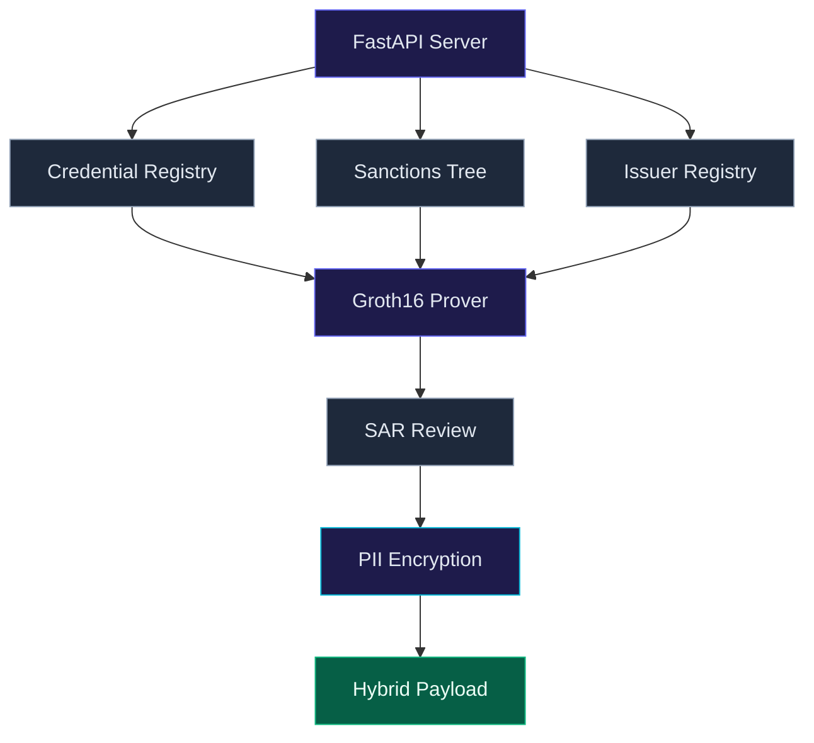
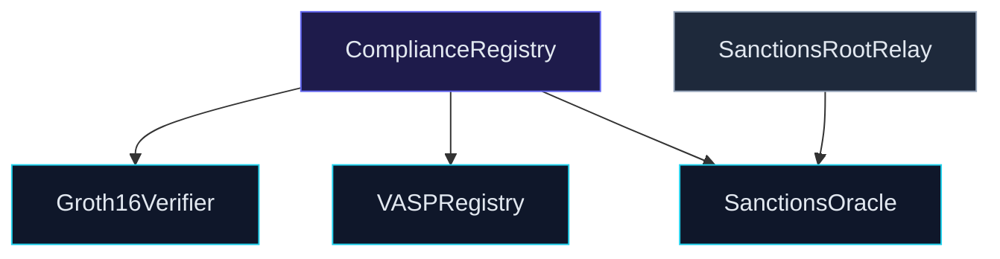
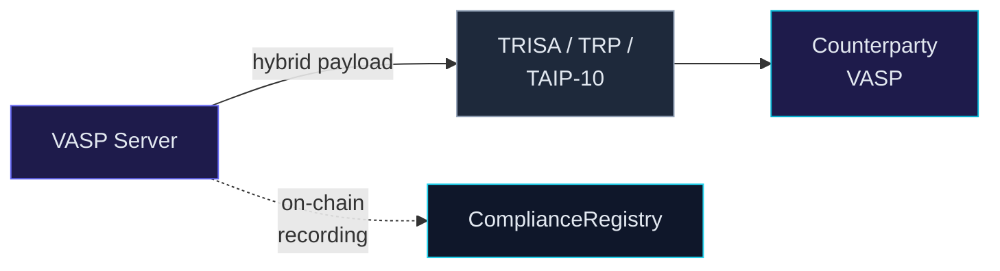
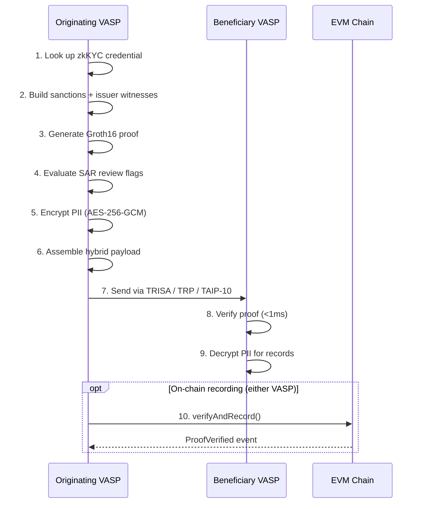
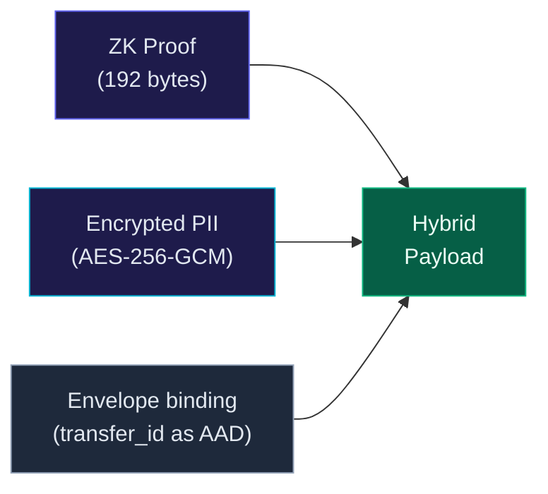
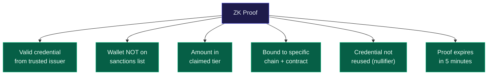

# Architecture

## Overview

clearproof is a monorepo spanning four languages:

- **Circom** — ZK circuit definitions
- **TypeScript** — Proof SDK, CLI, contract bindings
- **Python** — FastAPI server, registries, chain interaction
- **Solidity** — On-chain verifier, registries, compliance recording

## Component map

### VASP server

The [API server](/docs/api) collects witnesses from the [credential](/docs/circuits#credential-validity), [sanctions](/docs/sanctions), and [issuer](/docs/circuits#credential-validity) registries, passes all inputs to the [Groth16 prover](/docs/circuits), evaluates [SAR flags](/docs/security), [encrypts PII](/docs/security#pii-protection), and assembles the hybrid payload. This is a sequential pipeline, not parallel.

### On-chain contracts

[ComplianceRegistry](/docs/contracts#complianceregistry) is the main entry point. It calls [Groth16Verifier](/docs/contracts#groth16verifier) for cryptographic verification, checks [VASPRegistry](/docs/contracts#vaspregistry) for VASP identity and issuer roots, and validates the sanctions root against [SanctionsOracle](/docs/contracts#sanctionsoracle). [SanctionsRootRelay](/docs/contracts) receives root updates from a relayer or cross-chain bridge and forwards them to the oracle.

### How they connect

## Data flow: compliant transfer

Steps 1-6 happen sequentially inside the originating VASP. The SAR review (step 4) evaluates whether the transfer warrants human compliance review — this is advisory only, not an automatic SAR filing. On-chain recording (step 10) can be submitted by either the originating or beneficiary VASP.

See the [system diagram](/docs/system-diagram) for the full visual breakdown of each step.

## Hybrid payload

The [proof](/docs/circuits) is publicly verifiable. The [PII](/docs/security#pii-protection) is only readable by the intended counterparty. The envelope binding uses the transfer_id as AES-256-GCM associated data, preventing the encrypted PII from being replayed in a different transfer context.

## Security properties

The circuit proves all six properties simultaneously in a single Groth16 proof. They are independent — not sequential.

Click any property to see how the [circuit](/docs/circuits) enforces it.
