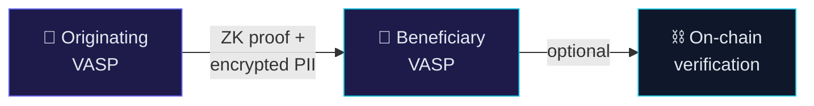
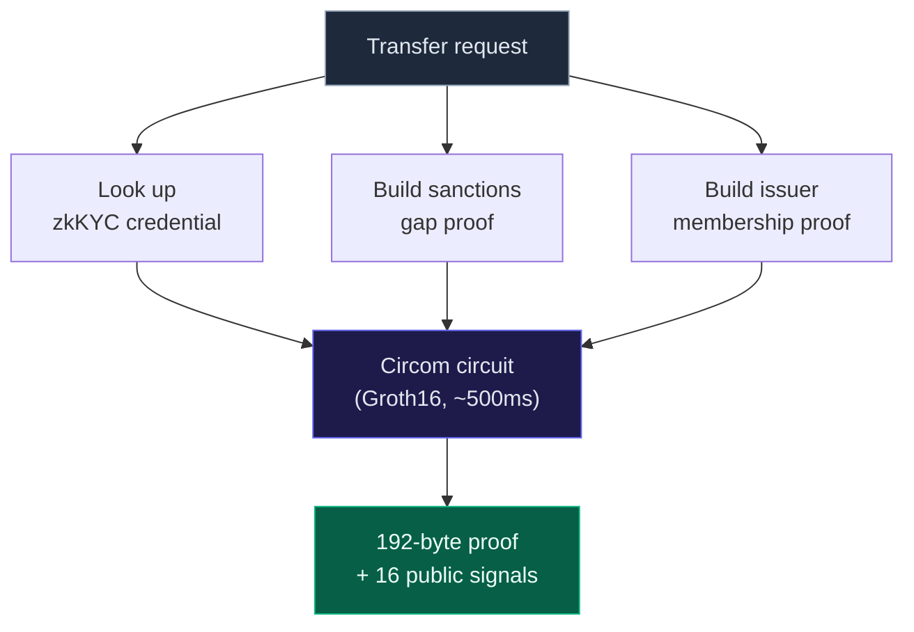
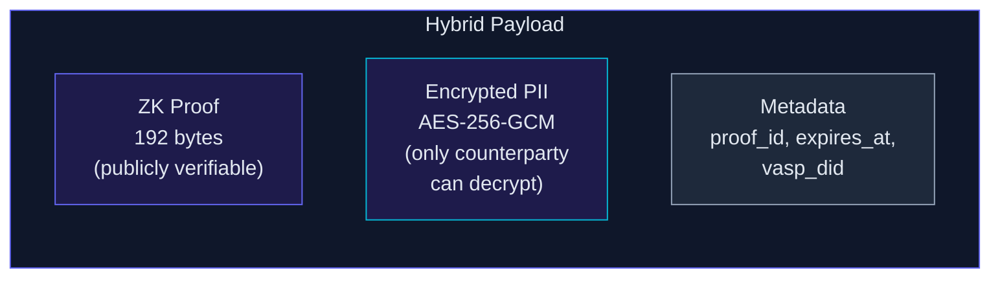
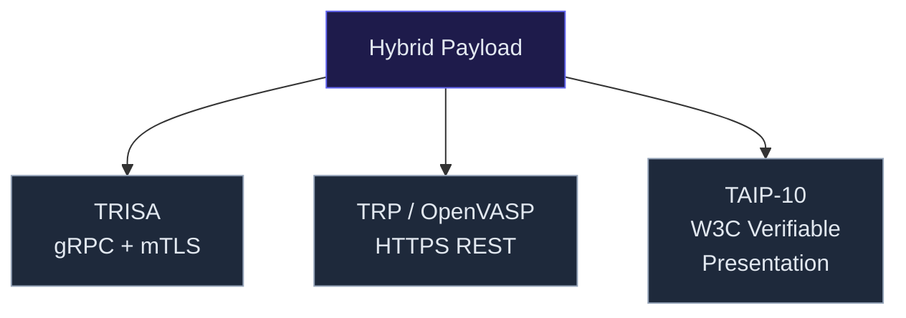
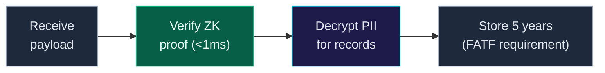
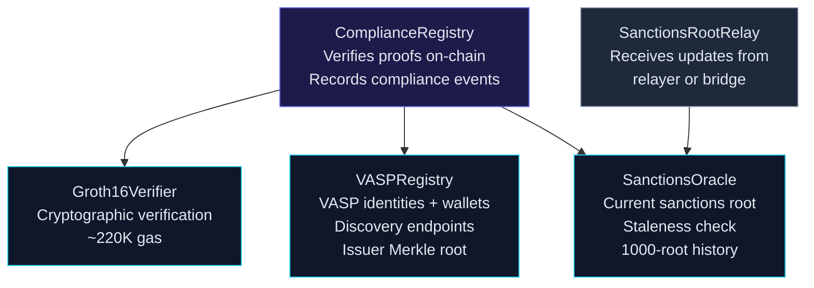
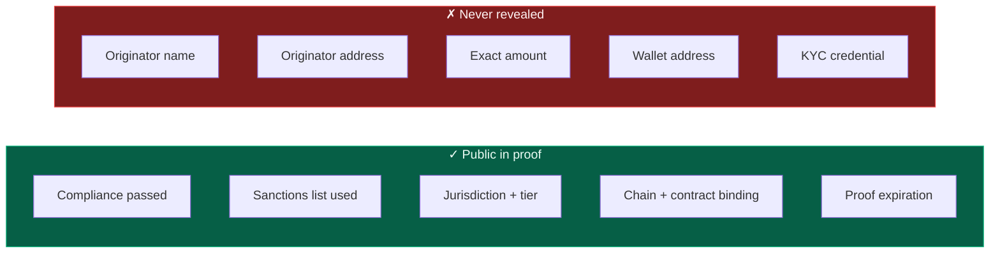
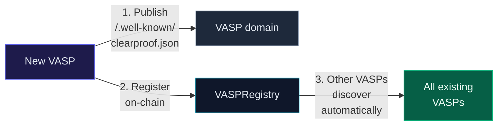
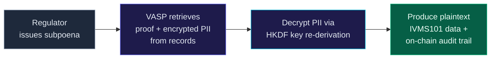

# System Diagram

## The core flow

The originating [VASP](/docs#terminology) generates a [ZK proof](/docs/circuits) that compliance was performed, encrypts the PII, and sends both to the counterparty. The counterparty verifies the proof without seeing the raw data. [On-chain recording](/docs/contracts) is optional.

---

## Step by step

### 1. Proof generation (originating VASP)

The [Circom circuit](/docs/circuits) composes four subcircuits: [credential validity](/docs/circuits#credential-validity), [sanctions non-membership](/docs/circuits#sanctions-non-membership), [amount tier](/docs/circuits#amount-tier), and domain binding + expiration. Output is a 192-byte Groth16 proof with [16 public signals](/docs/circuits#public-signals).

### 2. What goes into the hybrid payload

The [hybrid payload](/docs/architecture#hybrid-payload) bundles the [ZK proof](/docs/circuits) with [AES-256-GCM encrypted PII](/docs/security#pii-protection). The proof is publicly verifiable. The PII is readable only by the intended counterparty.

### 3. Transmission options

The payload is transmitted via existing Travel Rule protocols. clearproof replaces the payload content, not the transport.

### 4. Beneficiary verification

The beneficiary [verifies the proof](/docs/sdk) locally in under 1ms using the [TypeScript SDK](/docs/sdk). PII is [decrypted](/docs/security#pii-protection) for record-keeping as required by FATF.

---

## On-chain contracts

Four contracts deployed on [Sepolia](/docs/contracts#development). [ComplianceRegistry](/docs/contracts#complianceregistry) orchestrates verification by calling the [Groth16Verifier](/docs/contracts#groth16verifier), checking the [VASPRegistry](/docs/contracts#vaspregistry), and validating against the [SanctionsOracle](/docs/contracts#sanctionsoracle).

---

## What the proof reveals vs. hides

All [16 public signals](/docs/circuits#public-signals) are designed to prove compliance without exposing private data. See the [circuits page](/docs/circuits) for the full signal table.

---

## Sanctions oracle update

The [sanctions Merkle tree](/docs/sanctions#tree-structure) is rebuilt daily from OFAC and EU data. Updates follow a [PR-based workflow](/docs/sanctions#update-workflow) with human review before the root is [relayed on-chain](/docs/sanctions#staleness).

---

## VASP discovery

New VASPs join by publishing a [well-known JSON file](/docs/quickstart) and [registering on-chain](/docs/contracts#vaspregistry). Discovery is automatic — no manual configuration.

---

## Regulatory audit path

Regulators access plaintext PII through the [VASP's internal records](/docs/security#pii-protection), not through the blockchain. The ZK proof and [on-chain events](/docs/contracts#complianceregistry) provide a verifiable audit trail.
