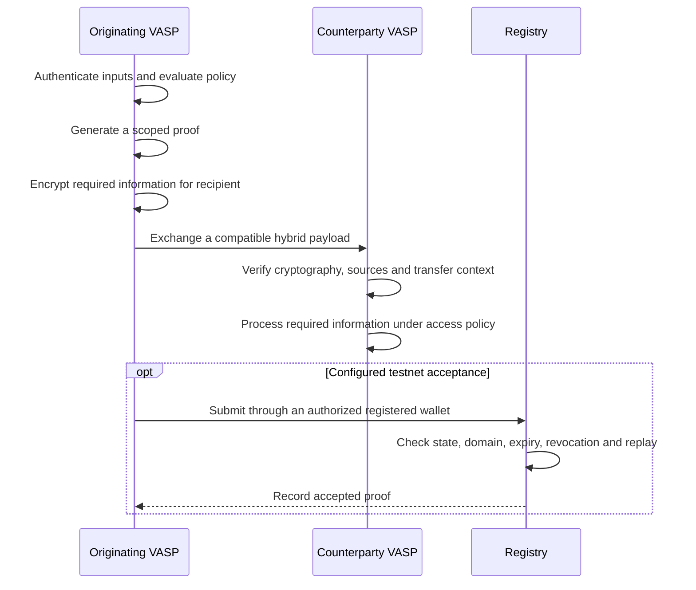

# System diagram

This is a conceptual transfer-evidence workflow. It separates the intended responsibilities; it is not a claim that the current prototypes complete every step.

```mermaid
sequenceDiagram
    participant O as Originating VASP
    participant B as Counterparty VASP
    participant R as Registry
    O->>O: Authenticate inputs and evaluate policy
    O->>O: Generate a scoped proof
    O->>O: Encrypt required information for recipient
    O->>B: Exchange a compatible hybrid payload
    B->>B: Verify cryptography, sources and transfer context
    B->>B: Process required information under access policy
    opt Configured testnet acceptance
        O->>R: Submit through an authorized registered wallet
        R->>R: Check state, domain, expiry, revocation and replay
        R-->>O: Record accepted proof
    end
```

Current bridge implementations are prototypes. Authentic credential/holder/transfer binding and API/SDK/registry acceptance parity require further work. On-chain acceptance does not establish settlement or regulatory compliance.

## Separate state tracks

| Track | Question |
| --- | --- |
| Policy | What was evaluated and which outcome was reached? |
| Counterparty exchange | Was required information delivered and accepted? |
| Proof | Does the proof verify under the approved statement and key? |
| Authorization | Are trusted state, freshness, binding and replay requirements satisfied? |
| Settlement | Was the custody/chain transfer actually completed? |
| Evidence | Can a reviewer reconstruct the scoped decision later? |

Joining these tracks into an investigation timeline and durable historical bundle is planned work. See [architecture](/docs/architecture), [contracts](/docs/contracts) and [status](/docs/status).
