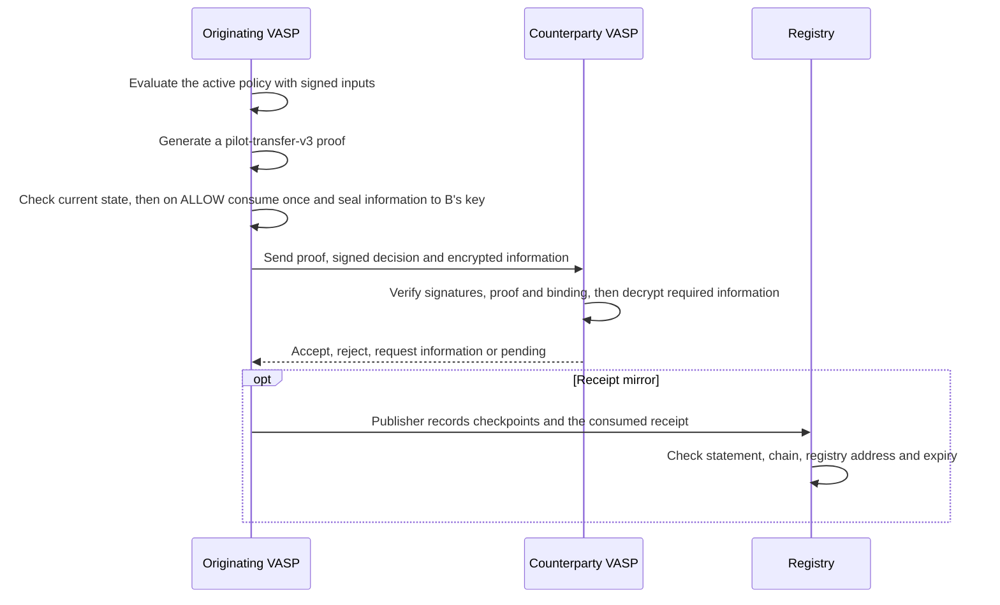

# System diagram

This is the transfer-evidence workflow. The pilot implements the originating side, a simulated counterparty and receipt mirroring, tested locally. Remote delivery to a live counterparty is not yet implemented.

```mermaid
sequenceDiagram
    participant O as Originating VASP
    participant B as Counterparty VASP
    participant R as Registry
    O->>O: Evaluate the active policy with signed inputs
    O->>O: Generate a pilot-transfer-v3 proof
    O->>O: Check current state, then on ALLOW consume once and seal information to B's key
    O->>B: Send proof, signed decision and encrypted information
    B->>B: Verify signatures, proof and binding, then decrypt required information
    B-->>O: Accept, reject, request information or pending
    opt Receipt mirror
        O->>R: Publisher records checkpoints and the consumed receipt
        R->>R: Check statement, chain, registry address and expiry
    end
```

The counterparty step runs against a local simulator; TRP and TRISA bridges remain prototypes. A mirrored receipt does not establish settlement or regulatory compliance.

## Separate state tracks

| Track | Question |
| --- | --- |
| Policy | What was evaluated and which outcome was reached? |
| Counterparty exchange | Was required information delivered and accepted? |
| Proof | Does the proof verify under the approved statement and key? |
| Authorization | Are trusted state, freshness, binding and replay requirements satisfied? |
| Settlement | Was the custody/chain transfer actually completed? |
| Evidence | Can a reviewer reconstruct the scoped decision later? |

The pilot keeps these tracks separate, joins them into investigation timelines, and exports them as encrypted historical bundles for offline review. See [architecture](/docs/architecture), [contracts](/docs/contracts) and [status](/docs/status).
