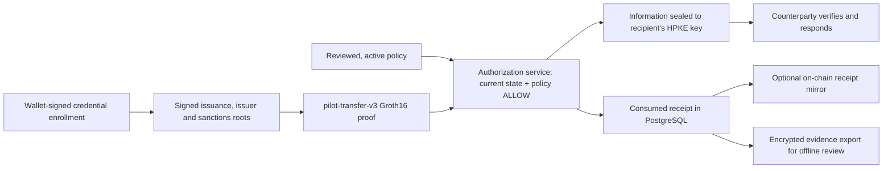

# Architecture

clearproof combines a Python API with PostgreSQL storage, Circom circuits, TypeScript proof tooling and Solidity contracts. The pilot workflow below is implemented in the source checkout and tested locally with synthetic data and real development proofs. It has not been independently audited or deployed to production.

## Pilot workflow

## Responsibilities

The **circuit** proves the transfer projection, credential, issuer membership and sanctions non-membership relationships. See [circuits](/docs/circuits).

The **authorization service** checks everything the circuit cannot: the current roots and their signatures, credential revocation, the active policy, signed valuation and external facts, and the real proof pairing. Only a policy `ALLOW` can consume an authorization. `DENY`, `REVIEW`, `INDETERMINATE`, invalid pairing and untrusted inputs cannot. On `ALLOW` it seals the approved transfer information to a trusted recipient key and records the evidence, the receipt and the consumed nullifier in one PostgreSQL transaction.

The **contract** (`PilotCurrentRegistry`) mirrors receipts that were already consumed, under checkpoints published by a trusted publisher. It checks the chain ID, its own address and the expiry, but it cannot create an authorization or detect a publisher that lies about private records.

Read-only inspection and observation never consume an authorization.

## Around the proof

- **Policy review:** explained outcomes, stored comparisons of a proposed policy against past cases, and separate approval and activation history.
- **Investigations:** read-only timelines that join policy, counterparty, custody, chain and evidence events, keeping duplicates, ordering and unresolved conflicts visible.
- **Historical evidence:** recipient-encrypted exports that an independent reviewer can check offline after the proof expires, using separately configured trust.
- **Observation mode:** runs alongside an existing workflow and records explained outcomes without authorizing anything.

## Legacy path

The original `compliance.circom` profile, `/proof/generate`, `/proof/verify`, the `ComplianceRegistry` contract and the hybrid payload remain as a separate demo and parity path. Their proofs are not current pilot authorization.

## Not yet done

Live provider and counterparty interoperability, remote TRP/TRISA conformance, re-screening from an upstream feed, managed distribution, an independent audit and a production setup are separate follow-on gates. See [project status](/docs/status).
