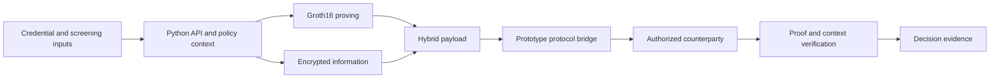

# Architecture

clearproof combines Python API/protocol/storage components, Circom circuits, TypeScript proof tooling and Solidity contracts. The diagram describes the intended integration; prototype components do not establish a complete production workflow.

## Component boundaries

Authenticated issuance, holder/transaction binding, durable tenant state, trusted recipient discovery and complete verifier parity remain active work. The current protocol bridges need real bilateral interoperability evidence.

## Verification responsibilities

The circuit constrains particular mathematical relationships. The application establishes trusted input sources and the policy context. The registry additionally checks on-chain state, domain, expiry, revocation and replay. Do not collapse these into a single claim that every security property is proved by the circuit.

The development registry includes a versioned verifier router. A deployed registry and its selector/artifacts must be checked against the intended proof version.

## Hybrid payload

A payload combines proof material with encrypted personal information and envelope-binding metadata. The authorized recipient still receives required personal information. Key establishment and migration must be tested; the existence of ciphertext does not prove that the intended recipient can decrypt it.

Public proof metadata can reveal or correlate information. See [privacy](/docs/gdpr) and [security](/docs/security).

## Planned operational layer

Policy-change comparison, event reconciliation, historical evidence verification and observation onboarding are planned pilot workflows. They extend the component architecture and are not yet generally available.

See [system diagram](/docs/system-diagram) and [project status](/docs/status).
